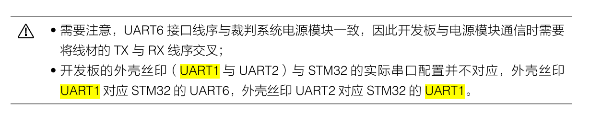
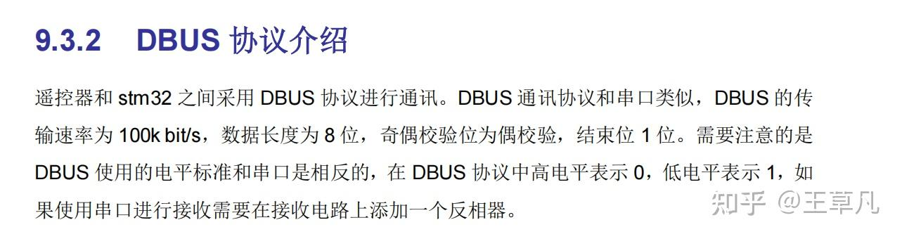
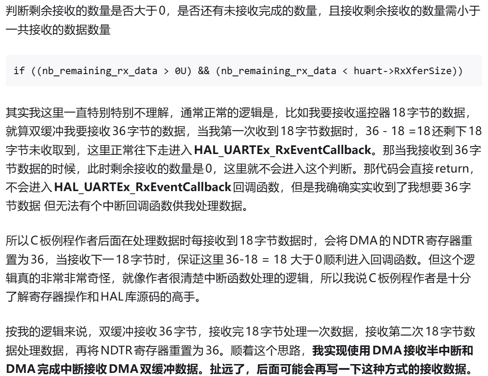
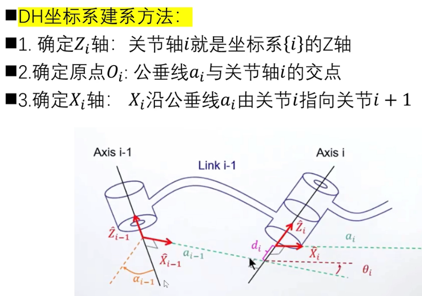
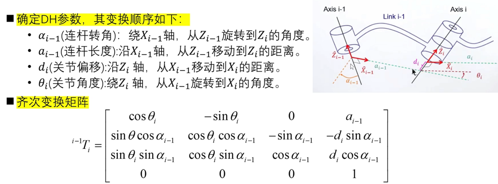
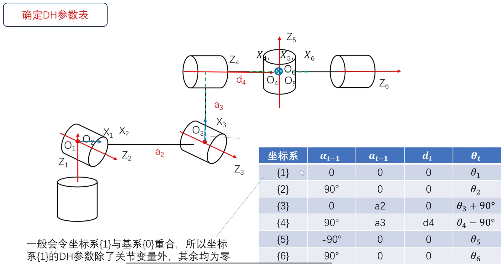
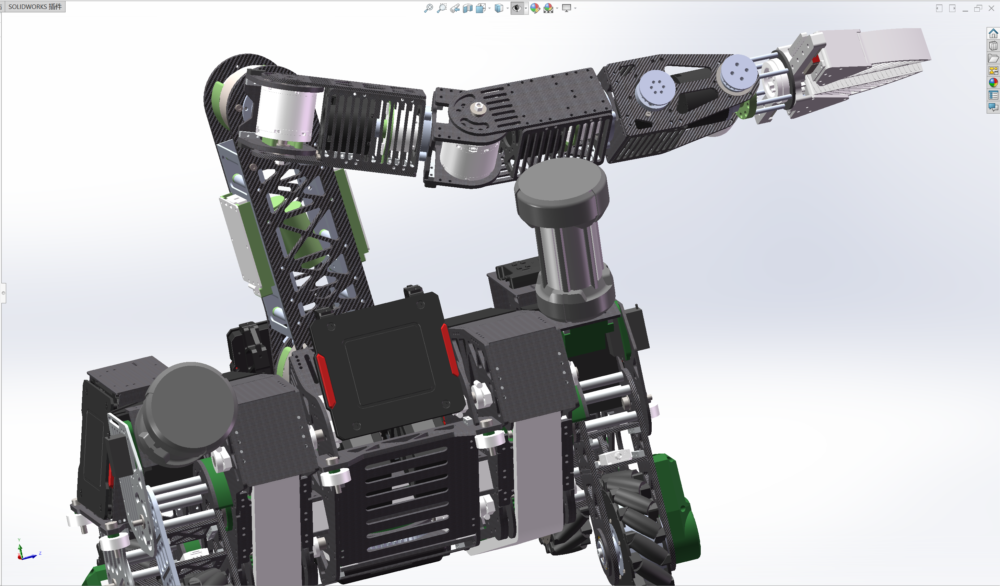
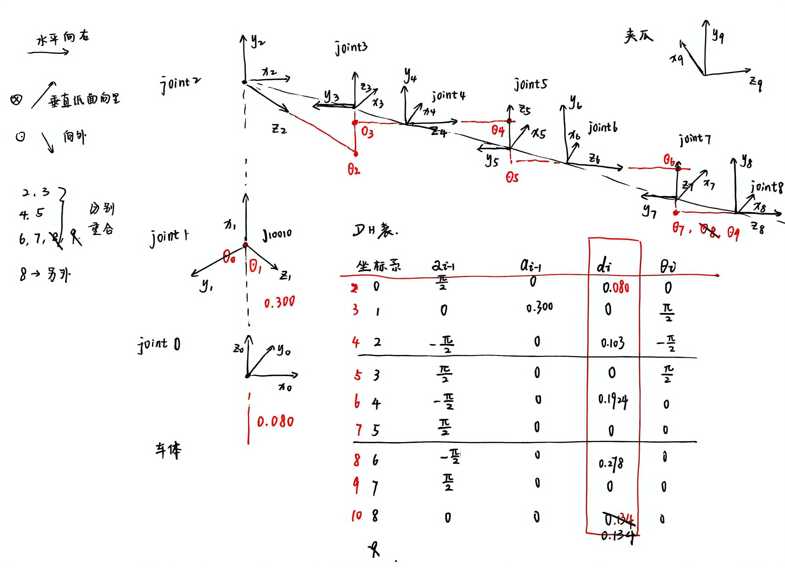
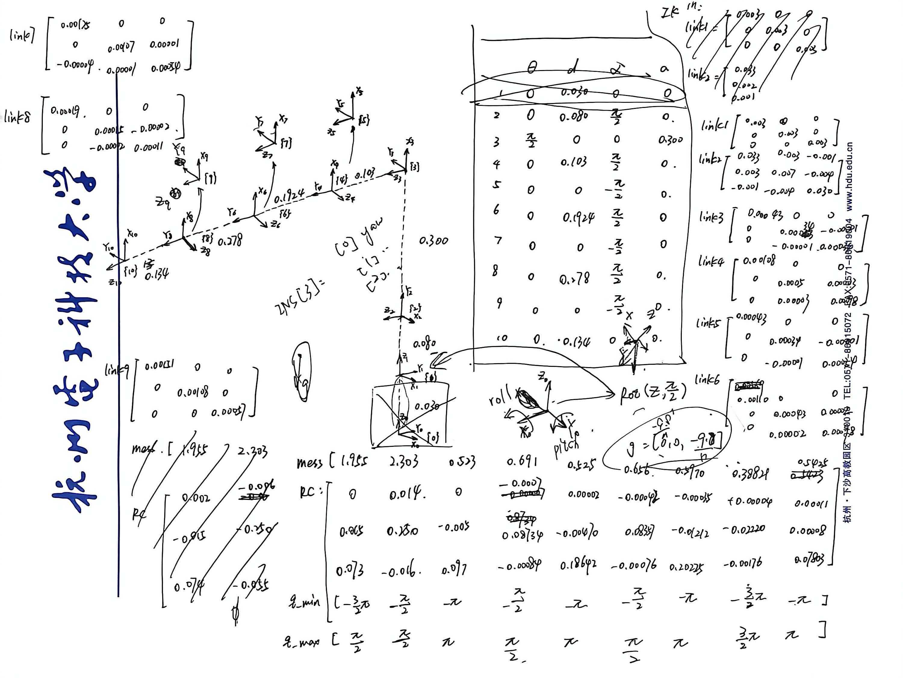

# 图例
❓问题
💡自己/同届的经验
⭐来自ai的解答
🤗来自他人的解答
👿我闯过的祸/差点闯的祸
# Git
(Git的风格：没有消息就是好消息)
* 初始化仓库```git init```
* 将远程仓库连接到本地```git remote add origin <your_repository_url>```
* 从远程仓库中拉取分支```git pull origin <your_branch>``` <your_branch>是远程仓库的分支名称，通常是master或main  
* 使能大小写敏感```git config core. ignorecase false```防止路径文件出现差错，原先大小写改名后git不会识别，加上这条命令之后就会识别了
* 添加.gitignore文件。是个纯文本文件，以换行回车分割不同的条目，每条是文件或者文件夹的路径如果不想忽略某个被ignore路径下的某个文件，可以在该文件前加“！”.girignore可以放在工程中的任意路径，该规则对该路径的全部文件和文件夹起作用。  
作用：保护关键文件不被修改
防止不必要的大文件占用仓库资源
比如：开发环境记录文件（.vscode），编译中间产生的文件(debug)，配置文件，本地日志文件
* 克隆远程仓库到本地```git clone <your_repository_url>```直接将远程仓库克隆到本地，此操作会自动生成仓库对应的文件夹，文件夹里面有.git文件，用于存放git的相关配置信息。<your_repository_url>是你远程仓库的地址
* 代码拉取```git pull origin <your_repository_url>```
* 代码推送```git stash/git pull/git stash pop/git add ./git commit -m"<your_repository_url>"/git push```当你完成了一个功能并测试通过后，即可进行代码推送，推送代码前记得同步远程的最新代码仓库，即执行代码拉取
* **❓git没有权限直接修改仓库，如何提交pr？**  
💡
* **❓与别人合作时正确且安全且建议的git命令顺序**  
🤗hwx:建议流程为:```git status```(检查目前根在哪里 以及我修改了哪些文件 要提交哪些)->```git stash``` (暂存所有更改)->```git pull``` (拉取最新更新 看看有没有别人提交了)->```git stash pop```(然后处理可能存在的冲突)->最后```git add``` 你需要的文件->```git commit -m```->```git push```(完成本次提交)  
👿2026/5/6差点在head游离分支里面提交修改导致更改全部丢失，然后还把修改提交到submodule了(~~属实非常丢人了~~)
# 开发板
## dji.c型开发板
* 💡大疆c型开发板uart实际接口和丝印不是对应的！

## DM_MC02开发板
* 🤗王草凡：  

# Algorithm
## PID
* **❓PID算法的结果最终通过can通信传送到电机的时候，要将浮点数四舍五入成整数，这对最终的电机控制没有影响吗**  
🤗hwx：没有（暂时还没遇到过）
## 双缓冲
* 先了解网络协议，🤗王草凡：SBUS和DBUS不一样(这里的电平反向也是一个坑)，h7开发板串口数据位配置成9位，校验位结束位基本不影响数据的接收，uart5引脚不对应(具体参见开发板->DM_MC02章节)  


* 串口空闲中断的回调函数
```c
void HAL_UARTEx_RxEventCallback(UART_HandleTypeDef *huart, uint16_t Size)
```
* DMA双缓冲区整体初始化代码（这里是自己封装，HAL库应该有另外封装过）
```c
static void USART_DMAEx_MultiBuffer_Init(UART_HandleTypeDef *huart, uint32_t *DstAddress, uint32_t *SecondMemAddress, uint32_t DataLength)
{
 //🤗使用串口空闲中断处理数据
 huart->ReceptionType = HAL_UART_RECEPTION_TOIDLE;//接收数据类型
 huart->RxEventType = HAL_UART_RXEVENT_IDLE;//接收事件
 //🤗串口接收数据的长度(36)
 huart->RxXferSize = DataLength;
 //🤗使能串口DMA模式，此处直接操作寄存器
 SET_BIT(huart->Instance->CR3,USART_CR3_DMAR);
 //使能串口空闲中断
 __HAL_UART_ENABLE_IT(huart, UART_IT_IDLE); 
 //🤗在设置DMA接收起点和终点时关闭DMA数据传输，DMA在设置好传输起点、终点时将自动开始传输。且数据传输的地址受到保护，需要关闭DMA传输时才可写入，所以在配置DMA的传输起点和终点的地址前需要先关闭DMA数据传输，以免发生传输意外
do{
    //🤗关闭DMA，查看该函数的定义后发现是将DMA 数据流 x 配置寄存器 (DMA_SxCR) 中的EN位置0，用一个do while 来判断 CR寄存器中的EN位是否置0，如果置0，退出循环，下面配置好DMA传输起点、终点后，要使能DMA传输，将EN位置1
      __HAL_DMA_DISABLE(huart->hdmarx);
  }while(((DMA_Stream_TypeDef  *)huart->hdmarx->Instance)->CR & DMA_SxCR_EN);
//🤗设置DMA传输终点、起点
//🤗注意，这里的寄存器是一个32位的地址。即需要传输数据外设的地址，也就是DMA传输的起点。而串口有其数据接收寄存器，该寄存器将接收到的数据一位一位的存放在这里，所以将DMA 数据流 x 外设地址寄存器 (DMA_SxPAR) 等于USART 接收数据寄存器 (USART_RDR)即可。注意：STM32F4系列的串口数据接收寄存器为DR，少一个R
((DMA_Stream_TypeDef  *)huart->hdmarx->Instance)->PAR = (uint32_t)&huart->Instance->RDR;
//🤗接下来配置DMA传输终点，因为使用的是双缓冲区DMA接收，所以需配置两个储存器地址
((DMA_Stream_TypeDef  *)huart->hdmarx->Instance)->M0AR = (uint32_t)DstAddress;
((DMA_Stream_TypeDef  *)huart->hdmarx->Instance)->M1AR (uint32_t)SecondMemAddress;
//🤗设置DMA数据传输量
((DMA_Stream_TypeDef  *)huart->hdmarx->Instance)->NDTR = DataLength;
//💡开启硬件自动切换，使能 DMA 的双缓冲模式（乒乓缓冲）
SET_BIT(((DMA_Stream_TypeDef  *)huart->hdmarx->Instance)->CR, DMA_SxCR_DBM);
//🤗使能DMA，前面因为设置DMA地址时关闭了DMA使能，最后要将DMA重新使能才可传输
__HAL_DMA_ENABLE(huart->hdmarx);	
}
```
* 函数名称和传参类型
```c
static void USART_DMAEx_MultiBuffer_Init(UART_HandleTypeDef *huart, uint32_t *DstAddress, uint32_t *SecondMemAddress, uint32_t DataLength)
```
解释
```text
UART_HandleTypeDef *huart：接收哪个串口数据的结构体指针。
uint32_t *DstAddress：第一个缓冲区的地址
uint32_t *SecondMemAddress ：第二个缓冲区的地址
uint32_t DataLength：接收数据的长度

我们使用 串口5接收遥控器数据 UART_HandleTypeDef *huart = huart5
定义一个二维数组，用来作为两个缓冲区，其中RC_FRAME_LENGTH为18，即DT7遥控器一次发送的数据量为18字节
uint8_t SBUS_MultiRx_Buf[2][RC_FRAME_LENGTH];
所以 uint32_t *DstAddress = SBUS_MultiRx_Buf[0];
uint32_t *SecondMemAddress = SBUS_MultiRx_Buf[1];
因为我们要接收两个缓冲区数据量的数据，所以接收数据的长度为18*2 = 36
uint32_t DataLength = 36
```
* c板例程
```C
static void USART_RxDMA_DoubleBuffer_Init(UART_HandleTypeDef *huart, uint32_t *DstAddress, uint32_t *SecondMemAddress, uint32_t DataLength){ 

 huart->ReceptionType = HAL_UART_RECEPTION_TOIDLE; 

 huart->RxEventType = HAL_UART_RXEVENT_IDLE; 

 huart->RxXferSize = DataLength; 

 SET_BIT(huart->Instance->CR3,USART_CR3_DMAR); 

 __HAL_UART_ENABLE_IT(huart, UART_IT_IDLE);  
 
 HAL_DMAEx_MultiBufferStart(huart->hdmarx,(uint32_t)&huart->Instance->RDR,(uint32_t)DstAddress,(uint32_t)SecondMemAddress,DataLength); 
 }
```
* **Think**
* 🤗王草凡：

* 这里关闭dma防止切换时出错的逻辑应该是有问题的，这样会导致另一个current_read的缓冲区无法写入，推荐DBM硬件自动切换  
⭐
```c
void USER_USART5_RxHandler(UART_HandleTypeDef *huart, uint16_t Size)
{
    // 不关 DMA！直接读"非当前"的缓冲区
    if ((DMA_Stream->CR & DMA_SxCR_CT) == 0) {
        // DMA 在用 Buffer0，说明 Buffer1 已满
        SBUS_TO_RC(SBUS_MultiRx_Buf[1], &remote_ctrl);
    } else {
        // DMA 在用 Buffer1，说明 Buffer0 已满  
        SBUS_TO_RC(SBUS_MultiRx_Buf[0], &remote_ctrl);
    }
    // 只需要：清中断标志，可能的话确认 CNDTR 正确
    // 不需要：DISABLE / 改 CT / 重装 CNDTR / ENABLE
}
```
* ❓失能dma不是会影响数据接收吗，前面开启了dbm结果后面处理数据的时候手动失能，再手动切换cr,ct，这样是不是失去双缓冲的意义了？
## DH
* 确定坐标轴  

* 各参数定义

* DH参数表

* 九轴机械臂dh表  



# Motor
## DM
**关于上位机**  
* v3版本的电机一定要通过can通讯更改fdcan模式，v4正常用uart串口更改就行 
* **❓针对v3版本电机，很多情况下会出现在你canid等配置均正确的情况下，uart能够通信上，但是can通信不上的情况，如何解决**  
💡用uart模式随便更改一个canid,然后转换到can模式，输入更改过后的canid，这样就能读取了（~~但是J10010电机好像不能这么干~~），最后再用uart模式改回你想要设置的目标canid  
* ❓**为什么上位机中的波特率和电机中设置的波特率不同也能正常进行通讯？**  
⭐DeepSeek说：主要是因为现代DM电机（尤其是基于CAN/CANopen协议的）普遍具备波特率自动检测功能。（我猜这里他说的自动检测功能是上位机的自动检测功能，如果是电机自动检测，自动适应的话，那理论上我程序里面随便设什么波特率都能正常跟电机建立通讯，但事实上不是这样的） 

**Questions**  
* ❓电机无法使能  
💡优先检查can总线终端电阻
* ❓电机编码器读过来的位置范围同样是-3.14~3.14，为什么有的电机要转4圈，有的只要转一圈？  
💡
 ## Dji

# Ozone
**Questions**  
* **烧录代码时，读条后显示部分代码未成功烧录：**  
💡关闭其他烧录软件，比如你用ozone同时开了两个工程，或者另外一个类似于ozone的软件正在占用资源。如果还是没有用的话就把jlink拔插一下（~~重启解决90%的问题~~）

# CubeMx
**Questions**
* ❓配置好cubemx，generatecode后，软件(keil,clion,vscode)里面没有更新  
💡看着cubemx把代码generate完再切换界面，提早切换界面有概率不更新代码(~~非常傻逼，对~~)
# SystemView
* 记得在freertos里面注册相应的中断钩子函数  
😈2026/5/12没有注册fdcan总线钩子(只取了名称)，导致system无法监看fdcan任务

**Questions**  
* **❓软件连接不上芯片：**  
💡确保芯片内部烧录了正确的代码   
💡在j_linkRTT模式下面，cores_number不能选择AUTO，手动输入数量  
💡Target->Recoder Configuration中没有jlink编号没关系的（多插jlink未尝试），只要jlink-commander识别到了就行  
💡查看是否代码里面是否正确开启了sysview（SEGGER_SYSVIEW_Conf();）
* **❓sysview软件里面可以看到有文件（说明正确连接到了芯片和文件），但是没有进入task和结束task的信息**  
💡可能是因为加了中间这行命令，Sysview大多不需要显式启动命令
```c
SEGGER_SYSVIEW_Conf();  
// SEGGER_SYSVIEW_Start();  
SystemView_Register_ISRs();  
```
* **❓如何修改system工程名字？**  
💡SEGGER_SYSVIEW_Config_FreeRTOS.c文件
```c
// The application name to be displayed in SystemViewer
#define SYSVIEW_APP_NAME        "9Axis_Arm_MC02_H7"     <-
```
* **❓出现Could not find systemview buffer:如何解决**  
💡检查STM32H723XG_FLASH.ld文件，大概率是因为程序摆放的位置不对，导致sysview找不到正确的读取位置
```c
/* Specify the memory areas */
MEMORY
{
DTCMRAM (xrw)      : ORIGIN = 0x20000000, LENGTH = 128K
RAM_D1 (xrw)       : ORIGIN = 0x24000000, LENGTH = 320K
RAM_D2 (xrw)       : ORIGIN = 0x30000000, LENGTH = 32K
RAM_D3 (xrw)       : ORIGIN = 0x38000000, LENGTH = 16K
ITCMRAM (xrw)      : ORIGIN = 0x00000000, LENGTH = 64K
FLASH (rx)         : ORIGIN = 0x8000000, LENGTH = 1024K
}
```
💡比如这个地方，一开始是写在DTCMRAM这里的，但是sysview没法读取，后来改成RAM_D1，才能读取成功，这里记得同步SEGGER_SYSVIEW_Config_FreeRTOS.c、SEGGER_SYSVIEW_Conf.h文件里的相应代码，同时修改STM32H723XG_FLASH.ld文件里面的所有相关代码。（<u>🤗hwx：因为这个是快速反应的，对外总线可能有点问题</u>）。FreeRTOSConfig记得包含相关头文件
```c
// The lowest RAM address used for IDs (pointers)
#define SYSVIEW_RAM_BASE        (0x24000000)           <-
```
```c
#define SEGGER_SYSVIEW_RTT_BUFFER_SIZE      4096
#define SEGGER_SYSVIEW_ID_BASE              0x24000000 <-
#define SEGGER_SYSVIEW_ID_SHIFT             2
```
❓STM32H723XG_FLASH.ld文件是干嘛的？  
⭐这是GCC工具链脚本，用来规定程序在flash/RAM里面如何摆放。后缀.ld：GNU Linker Script指的是GCC连接器的配置文件  
❓<u>但是也碰到过这样的问题，全部配置正确后还是有这个错误提示，我尝试添加```SEGGER_SYSVIEW_Start();  ```后，就能够读取文件信息，然后在把这行代码删掉，就能够正常运行了</u>
* **❓中断枚举结构体不能用了咋办？**  
💡大概率是芯片不一样了，更改芯片头文件  
* **❓<u>了解sysview栈溢出是怎么回事，六轴碰到过，但是九轴目前还没有碰到</u>**

# 轮腿
[ACE战队 2024-2025赛季轮腿机器人技术文档-机械](https://bbs.robomaster.com/article/728195)

# 实操
## 焊接
* 检查电源供电是否正常
## 接线
* **👿拿到图纸首先考虑要不要镜像，特别是航插！（2026/5/4航插接线未考虑镜像，对着电路板和航插手册直接开始编号导致正负和fdcan全部接反，还好有电管。但是修补过后的接线很丑！！！）**
* 线头不要裸露，能固定的全部固定，能扎紧的全部扎紧
## 调车
# 好奇宝宝：想到什么问什么系列
* **❓为什么windows系统比较难连接git，乌班图比较好连接?**  
⭐Git 原生是为 Linux/Unix 设计的，Ubuntu 天生适配；Windows 是 “移植版”，多层兼容导致坑多、网络更易出问题。
* **❓但是在同一个网络状态下，乌班图和windows的连接速度还是有差异啊，连接git看的难道不是是网络协议，跟操作系统的适配性关系应该不大吧？**  
⭐Git 走的就是 HTTP/HTTPS、SSH 标准网络协议，理论上跟系统无关；但实际同网下 Ubuntu 就是比 Windows 连 Git 更快、更稳，根本不是协议不一样，是Windows 多了好几层额外 “中间商 + 拦截层”，Ubuntu 裸连直通。  
⭐Ubuntu：用系统原生 OpenSSH / 原生 curl，是业界标准原版实现，握手、加密、分包、超时控制都是最优原生参数。  
⭐Windows：Git-for-Windows 自带自制精简版 SSH/curl，不是官方原版；
要么调用 Windows 系统自带的阉割版 OpenSSH，算法握手、TCP 参数都不如 Linux 优化得好。  
⭐Windows 必经三层 “关卡”  
Windows 防火墙 默认会扫描 Git 网络连接  
Defender / 杀毒 实时扫描 Git 发包、收包  
Git Bash / MinGW 兼容层 额外包一层虚拟环境转译  
每一层都要拆包、检测、重组包，延迟拉高、速度被限流。  
⭐差在：协议实现质量 + Windows 多层安全拦截 + TCP 内核优化 + 无兼容层损耗；不是协议不一样，是 Windows 跑 Git 要穿三层马甲，Ubuntu 裸奔直连，同网速度必然有差距。

* **❓为什么vscode,clion等软件,我在本地写的代码都不用特意保存，它会自动帮我记住一切？甚至很久之前的代码都可以不停ctrl+Z还原出来？**  
⭐这个无限撤回、能找回很久之前代码、不用手动存也能记改动，是 VSCode / CLion 自带的本地历史版本功能，编辑器自带「内存实时快照」，你每敲一个字母、删一行代码，VSCode/CLion 实时在内存里记下来，自带「本地文件历史记录」，编辑器会偷偷在电脑后台文件夹，给你的每一个文件自动存很多历史版本
* **❓它记录这么多版本，会不会很占内存？**  
⭐确实会占一点硬盘，但不占运行内存，占用极小，完全可以忽略，而且有自动清理、上限限制，不会无限膨胀，和你项目代码比，它占的空间连零头都不到。  
⭐内存（RAM）：编辑器只存当前编辑的改动，用完就扔，不常驻吃内存；  
⭐硬盘（SSD / 机械盘）：历史快照是存在硬盘隐藏缓存文件夹里，只耗硬盘，不卡电脑。  
⭐它不是每次都存完整一份代码文件用的是 差分增量存储：比如你原来 100 行代码，只改了 2 行， 编辑器只存改动的那 2 行，不是重新存整个文件，就像更新游戏补丁，只下改动部分，不下完整游戏包。  
⭐再加上：只存文本代码，不是视频图片，一份代码历史就几 KB，就算存几十版历史，也就几百KB，一个项目的全部本地历史，通常也就几MB，现在电脑硬盘随便几TB，完全没感觉。

* **❓lqr是什么**  
⭐LQR = Linear Quadratic Regulator，线性二次型调节器，是现代控制理论里最基础、工程用得最多的最优状态反馈控制器。简单说：它是一种比 PID 更 “聪明”、更稳、能直接做多变量控制的算法。  
和 PID 最关键区别  
PID：  
只看当前误差 + 过去误差 + 误差变化率  
靠经验调参，容易超调、震荡、慢  
单输入单输出（一个电机一个 PID）  
LQR：  
看全状态（位置、速度、角度、角速度……）  
数学直接算出最优反馈矩阵 K，理论上全局最优  
天然支持多变量耦合（比如机器人底盘同时控 x/y/ 偏航）  
响应快、超调小、鲁棒性好  
* **❓foc是什么**  
⭐FOC（Field-Oriented Control），即磁场定向控制，也称矢量控制，是目前永磁同步电机（PMSM）、无刷直流电机（BLDC）最高效的控制算法之一，核心是解耦控制转矩与磁场，实现直流电机般的平滑、高效、高动态性能。三相交流电机的电流是交变的，直接控制复杂。FOC 通过数学坐标变换（克拉克变换、帕克变换）：  
把三相交流电（ABC）转换成两相直流电（d-q 轴）；  
d 轴（直轴）：控制磁场（励磁）；  
q 轴（交轴）：控制转矩（出力）；  
分开调节 d、q 轴电流，再反变换回三相电压驱动电机。  
→ 结果：转矩平稳、噪声低、效率高、响应快，适合高精度、高效率场景。  
* **❓rfid是什么**  
⭐RFID = Radio Frequency Identification 射频识别简单说：不用接触、不用扫码，靠无线电波自动识别标签身份。
核心组成  
RFID 标签：贴在物品上，存 ID 信息，分两种  
无源：无电池，靠读卡器电磁波供电，便宜、用得最多  
有源：自带电池，距离远、成本高  
RFID 读卡器：发射射频信号、读取标签 ID / 数据  
后台系统：拿读到的 ID 做管理、统计、门禁、库存等  
* **❓为什么有时候函数结构体类型传错了，代码照样能跑？**  
💡因为你比较幸运，别的地方没有用更改后的结构体当入参的  
* **❓异步通信和差分信号之间有什么联系吗？**  
⭐它们是两个不同层面的概念，没有必然的绑定关系，但在实际工程中经常一起出现

**⭐概念分层**
| 层面 | 异步通信 | 差分信号 |
| --- | --- | --- |
| 所属层 | 协议/时序层（何时发、怎么同步） | 物理/电气层（用什么电压传） |
| 核心问题 | 收发双方没有共享时钟，如何对齐数据 | 如何抗干扰、提高信噪比 |
| 典型实现 | UART、CAN、USB（异步部分） | RS-485、CAN、LVDS、USB、以太网 |

**⭐常见组合**
| 组合 | 例子 | 说明 |
| --- | --- | --- |
| 异步 + 差分 ✅ 最常见 | CAN、RS-485、USB | 既无时钟线，又用差分抗干扰 |
| 异步 + 单端 | UART (TTL/CMOS 电平) | 短距离、板级通信，简单但抗干扰差 |
| 同步 + 差分 | SPI 走差分线（少见）、LVDS | 有时钟线，同时用差分提升速率 |
| 同步 + 单端 | I2C、SPI (TTL) | 短距离、低速，省线 |

**⭐为什么异步通信偏爱差分？**  
不是必须，而是工程上很搭

| 原因 | 解释 |
| --- | --- |
| 异步没有时钟恢复线 | 更需要可靠的信号边沿，差分提供更干净的跳变 |
| 异步通常走较长距离 | 差分的共模抑制比（CMRR）能抵消长线的噪声 |
| 异步协议往往面向工业/汽车 | CAN、RS-485 这些场景电磁环境恶劣，差分是刚需 |

异步通信关心什么时候传，差分信号关心怎么传得稳。二者正交，但异步场景往往更加需要差分来补偿没有时钟带来的鲁棒性挑战。
* **❓鲁棒性是什么？**  
⭐鲁棒性 = 系统在干扰、误差、异常情况下，依然能正常工作、不崩溃、不跑偏的能力。  
简单说：抗造、稳定、容错强。  
通俗解释  
环境变了一点 → 还能用  
输入有点噪声 / 误差 → 结果依然准  
出点小故障 → 不崩、不卡死  
这就叫鲁棒性好。  

