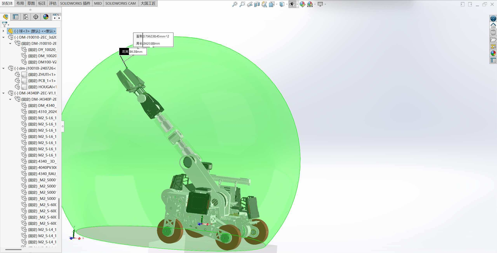
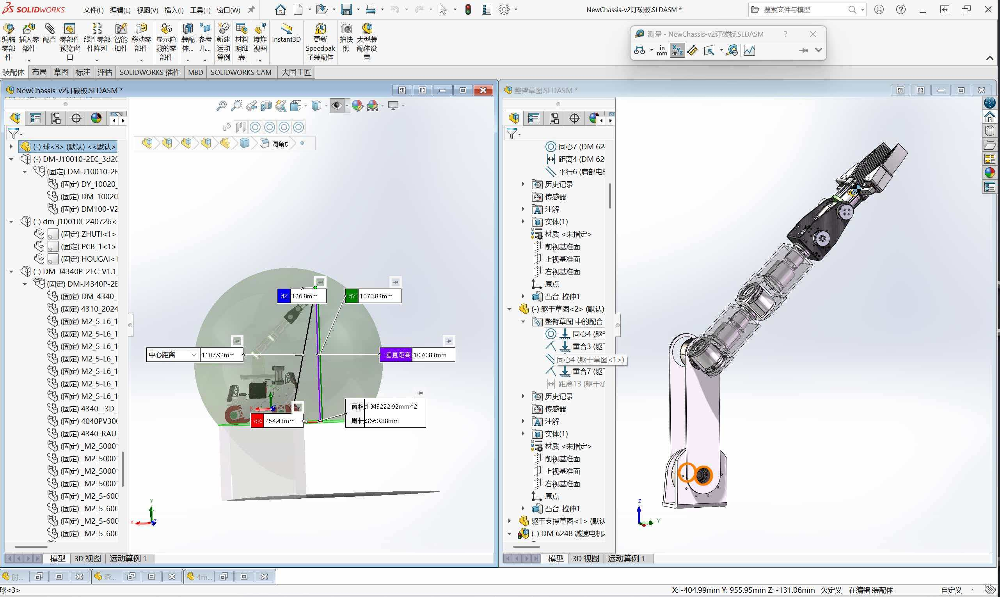
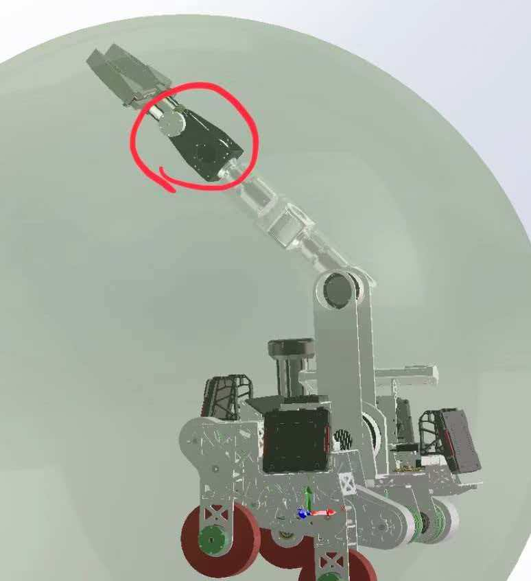

# 工程机器人制作流程
## 总体规划
1. 规划出来一周内确定整车功能
1. 开出工单，质量管理
1. 电控快速进行电机性能验证：平动速度，上岛，具体可以参考[南理开源](https://bbs.robomaster.com/article/43610)
1. 机械两周内快速出第一版结构图（可以不考虑螺丝孔，加工难度，只要确定大概长度和连接结构，甚至可以直接搬运现有的，当然不是照抄），示例：

1. 算法快速介入在mojoco等动力学中验证构型的运动学是否满足需求
1. 机械改第二版准备造车